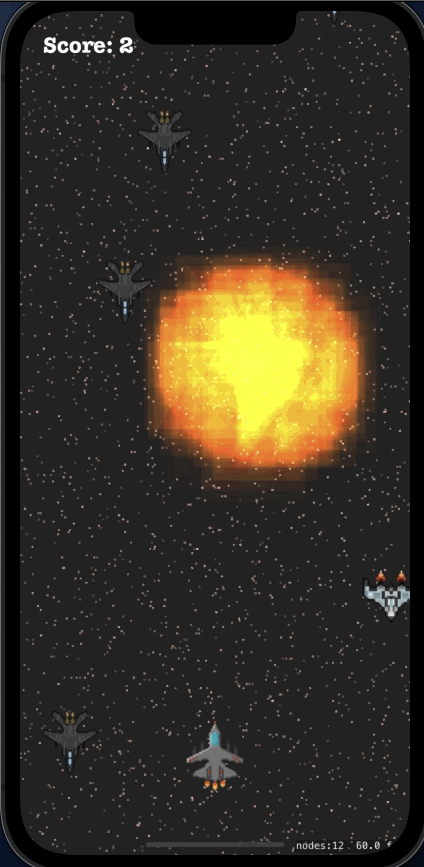

# Airforce Combat: Sky Guardians

##  Project Overview

"Airforce Combat: Sky Guardians" is a beta version of an exhilarating aerial combat game that plunges players into the heart of intense airforce battles. As a work-in-progress, it offers a taste of high-stakes fights, strategic air strikes, and dynamic flight mechanics, inviting players to navigate through treacherous skies and engage with enemy forces. This beta release is aimed at refining gameplay, enhancing features, and expanding content to elevate the player experience to new heights.

